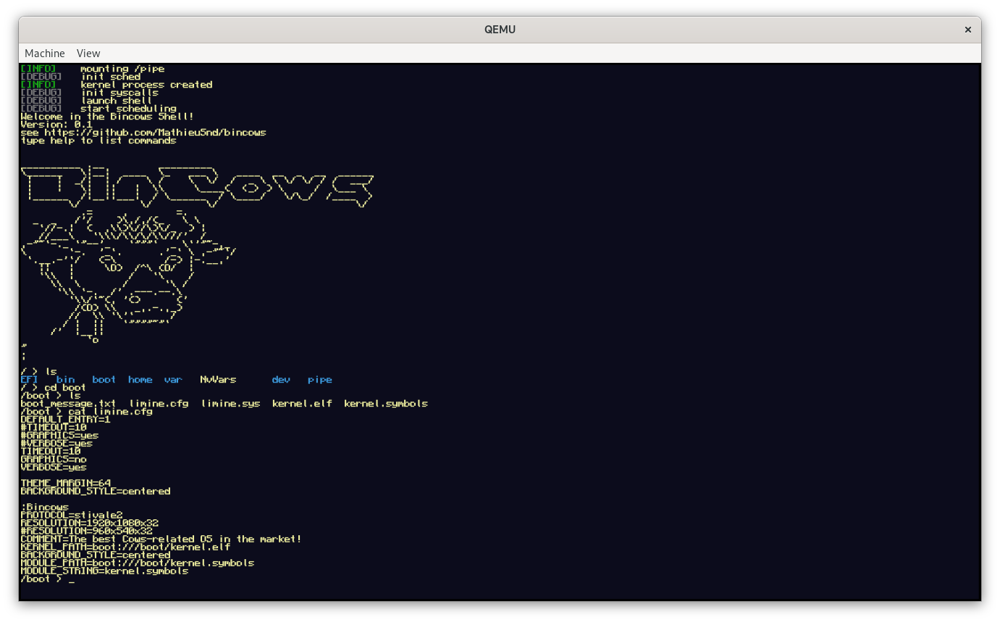

# Bincows Operating System


## About

Bincows aims to be an UNIX operating written in C system targeting x86_64 architecture. It is a side projet of mine to learn more about operating systems and practical development on modern systems such as desktop computers. It is very unstable, so booting it on your own machine is possible though discouraged.





Do not hesitate to leave an issue if you find a bug or cannot build and emulate the system.

## Features

For now, Bincows support driver for:  
- PCIe  
- PS/2 Keyboard  
- NVMe drives  

Bincows embeds a TTY shell with a set of programs:  
- ls  
- cat  
- txe (TeXt Editor)  
- clear  


It only uses one processor and Round Robin scheduling.


## Dependencies

Bincows __only supports the [Limine](https://github.com/limine-bootloader/limine) bootloader__. 

In order to build Bincows, you will need __x86_64-elf-gcc cross compiler__ along with x86_64_64-elf binutil.
By default, Bincows uses the [Lightweight AML Interpreter](https://github.com/managarm/lai) to exploit ACPI power
managment. You can define the `USE_LAI` as `0` to avoid using it.

To emulate Bincows, you will need __QEMU__ and an __UEFI BIOS for qemu__ (for example OVMF, of which a copy is available in this repository). See the [Emulation using QEMU](#emulation-using-qemu) section.


## Build

This section describes how to build the Bincows ecosystem (kernel, libc and programs)

To build the bincows ecosystem, you will need a __cross compiler__ (GCC and the GNU binutils suite) targeting x86_64 ELF. Consider visiting [this page](https://wiki.osdev.org/GCC_Cross-Compiler) to build one yourself or downloading a build. You have to define the `GNU_PREFIX` environment variable as the path to GCC and binutils bin directory.

If you don't disable the use of LAI by setting `USE_LAI` environment variable to `0`, you must recursively clone the repository to get the submodules.

Then, from the root of this repository, you can build the kernel, libc and programs by typing:
```
$ make all
```

The default kernel target is debug, since the system is still unstable. If you want to play with fire, you can change the target using an environment variable: 
`KERNEL_TARGET=release`


## Emulation using QEMU

Once the build succeed, you can run the following command to launch a qemu emulation:

```
$ make qemu_run
```

This will first create a binary image file containing a bincows partition, using a loopback device. __You will need superuser privileges to do so__. Then, it will lauch qemu with numberous arguments.


Note that you can parametrize the emulation using environment variables:

- `QEMU_RAM_MB` - number of megabytes of RAM. Defaults to 128.

- `QEMU_GRAPHICS_OPTIONS` - qemu graphical options. Defaults to `-vga virtio`. See QEMU documentation.

- `USED_LOOPBACK`: loopback device path. Defaults to `/dev/loop2`.

- `QEMU_BIOS_FILE`: path to the qemu bios. Defaults to `/usr/share/ovmf/OVMF.fd`

- `QEMU_LOG_FILE`: path to the the QEMU log file. Defaults to `qemu.log`

- `QEMU_EXTRA_OPTIONS`: additional options (e.g.: tracing events options). Defaults to an empty string

- `IMAGE_FILE`: path to the image file to build. Defaults to `disk.bin`


## Licence
This project is distributed under MIT Licence.

## What's next?

I currently work on multithreading, the support of inter-thread communication concepts of UNIX concepts.

Later on, I might work for the support to AHCI, a graphical desktop environment, SMP, etc.

